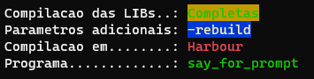

# say_for_prompt

**Descrição geral do projeto:** Rotina para facilitar escrever logs ou mensagens em Prompt/Bash de forma a posibilitar a escrita em várias cores.


````shell
 Sintaxe: say <mensagem> [<fore=cor>] [<back=cor>] ...

 <mensagem>: [Obrigatorio] Mensagem que sera exibida.
 <fore=cor>: [Opcional] Cor da letra exibida, sendo por padrao branco
 <back=cor>: [Opcional] Cor de fundo da escrita, sendo por padrao preto

 Lista de cores: preto, branco, vermelho, amarelo, azul, verde
                 (black, white, red, yellow, blue, green)


   Ex: say "Mensagem teste"
       say "Mensagem com cor" fore=red
       say "Mensagem " fore=branco "concatenada" fore=green
````


Nos exemplos a cima podemos utilizar diretamente o comando `say` pois o executavel está presente em alguma pasta de executaveis configurada no sistema operacional (SO).

> No `Windows` temos configurado nas variveis de ambiente a variavel **_Path_**, assim podemos colocar o executavel **say.exe** dentro de alguma das pastas previstas nesta variavel.

>Para o `Linux`, utilizando como base o SO Ubuntu, temos o caminho **_/usr/bin_** para adicionar o arquivo **say** (compilado em ambiente Linux)

<br>

## Arquivos versionados
---

| Arquivo       | Descrição                                           |
| ------------- |:----------------------------------------------------|
| **say.prg**   | Código fonte na linguagem Harbour (xBase)           |
| **say**       | Arquivo de execução compilado em **_Linux_** (x86)  |
| **say.exe**   | Arquivo de execução compilado em **_Windows_** (x86)|
| **test.sh**   | Testes para o executavel **_say_**       |
| **test.cmd**  | Testes para o executavel **_say.exe_**   |


<br>

## Resultado do Arquivo de teste
---

````shell
@echo off
cls
say.exe "Compilacao das LIBs..: " "Completas" fore=green back=yellow
say.exe "Parametros adicionais: " "-rebuild"  fore=yellow back=blue
say.exe "Compilacao em........: " "Harbour" fore=red
say.exe "Programa.............: " "say_for_prompt" fore=green
````



<br>

## Compilação
---
Para a compilação foi utilizado o compilador [HBMK2](https://sourceforge.net/projects/harbour-project/files/) com os seguintes parametros:

> hbmk2 say.prg -rebuild